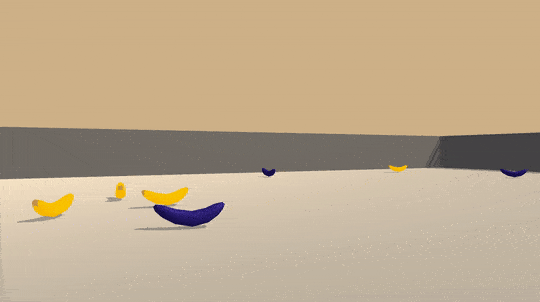

# DeepRLBanana

This Navigation project with Udacity's [Deep Reinforcement Learning Nanodegree](https://www.udacity.com/course/deep-reinforcement-learning-nanodegree--nd893) is my submission. 



For this project, I used the Deep Q-Leraning (DQN) to train an agent to selectively collect bananas in a two-dimensional space. This project uses a modified version of Unity's Banana Collector environment. The desired output or goal is for the agent to collect only the yellow bananas and avoid the blue bananas in the set environment.

The environment has a state space of 37 dimensions including basic information about the agent and the "ray-based" perception of the objects it can see. Note - For this project, no trainning was undertaken based on pixel values. 

The agent receives a reward of +1 for picking up a yellow banana and a -1 penalty/reward for picking up a blue banana. The environment is concsiderd solved when the agent receives an average score of +13 over 100 consecutive episodes. 

The agent has four discrete actions to choose from:
* 0 - Forward
* 1 - Backward
* 2 - Left
* 3 - Right

### Installation

Just a word of advice. The current Unity ML-Agents environment only supports Python 3.6. So the following steps need to be followed as well as everything in the attached Python folder needs to be installed.  

1. Clone this repository.
2. Navigate to the project directory.
3. Type the following in command line:

```shell
$ conda create --name drl python=3.6
```
 
```shell
$ activate drl
```
 
```shell
$ cd python
```
 
```shell
$ pip3 install .
```

The environment provided in the repository is for Windows (64-bit).

If you need a different version, download the environment from one of the links below. Replace the link in the code as needed.

1. [Linux](https://s3-us-west-1.amazonaws.com/udacity-drlnd/P1/Banana/Banana_Linux.zip)
2. [Mac OSX](https://s3-us-west-1.amazonaws.com/udacity-drlnd/P1/Banana/Banana.app.zip)
3. [Windows (32-bit)](https://s3-us-west-1.amazonaws.com/udacity-drlnd/P1/Banana/Banana_Windows_x86.zip)  
4. [Windows (64-bit)](https://s3-us-west-1.amazonaws.com/udacity-drlnd/P1/Banana/Banana_Windows_x86_64.zip)


### Run

In a terminal or command window, navigate to the main directory (that contains this README) and run the following command:

```shell
$ jupyter notebook
```
This opens the Jupyter Notebook. Navigate to the project and run the [navigation.ipynb](https://github.com/avpresbitero/deep-rl-banana/blob/master/navigation.ipynb) to replicate the experiments.