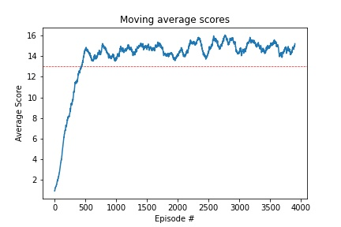

# Udacity Deep Reinforcement Learning 

## Navigation Project Executive Summary

Author: Alva Presbitero avpresbitero@gmail.com

### Overview

In this project, I will go over Deep Q Networks (DQN), a known approach in Reinforcement Learning that utilized neural networks for learning states and actions that give out the best rewards. This project is part of the Udacity Deep Reinforcement Learning nanodegree course.

The environment that we will learn from today is the world of bananas. The project's goal is to train an agent in such a way that it collects only the yellow bananas and avoid the blue bananas.

The project environment is built in Unity, specifically the Banana Collector version. 

### The Environment

Again the goal of this project is to train an agent to navigate (and collect bananas!) in a large, square world.

A reward of +1 is provided for collecting a yellow banana, and a reward of -1 is provided for collecting a blue banana. Thus, the goal of your agent is to collect as many yellow bananas as possible while avoiding blue bananas.

The state space has 37 dimensions and contains the agent's velocity, along with ray-based perception of objects around the agent's forward direction. Given this information, the agent has to learn how to best select actions. Four discrete actions are available, corresponding to:

 1. up
 2. down
 3. left
 3. right


### The Solution

The learning algorithm I picked for this project is a vanilla Deep Q-Learning algorithm, based on Deep Mind's paper entitled [Human Level Control Through Deep Reinforcement Learning](https://www.nature.com/articles/nature14236) published in Nature back in February 2015. 


### Model architecture

I ventured into the simpler/shallower network configurations as often times, simpler algrorithms achieve the desired results without compromising computational power. Hence, in this project, it would suffice to use a very simple 2-layer neural network was used (2 linear or fully connected layers) with input 37 and output 4. The architecture makes use of 64 and 128 neurons respectively.

```
QNetwork(
  (fc1): Linear(in_features=37, out_features=64, bias=True)
  (fc2): Linear(in_features=64, out_features=128, bias=True)
  (out): Linear(in_features=128, out_features=4, bias=True)
)
```

### Hyperparameters

The below hyperparameters were used to for the simulations. It would of course be interesting to play around with these hyperparameters, but the goal of the project was achieved by using the below values.

* Replay buffer size 100,000 
* Discount factor 0.99 (gamma)
* Soft update factor 0.001 (tau)
* Learning rate 0.0004 (alpha)
* Network update step interval 4

### Results

It was so interesting for me that a shallow vanilla implementation of the Deep Q-Learning algorithm was enough to solve the problem. Although of course, other more sophisticated algorithms may be used to achieve a higher score at lower runtime. But I think the current architecture I chose performed rather surprisingly well.

My laptop (ASUS Zenbook) CPU was enough to train the model. So cool!




```
QNetwork(
  (fc1): Linear(in_features=37, out_features=64, bias=True)
  (fc2): Linear(in_features=64, out_features=128, bias=True)
  (out): Linear(in_features=128, out_features=4, bias=True)
)
Episode 100	Average Score: 0.93
Episode 200	Average Score: 3.40
Episode 300	Average Score: 7.58
Episode 400	Average Score: 10.47
Episode 500	Average Score: 13.01
```

### Conclusion and Recommendations

Solving the task only required a shallow architecture as a task as simple as this would not require more complicated algorithms. However, Dueling DQN, Rainbow and other more advance implementations are still worth exploring as I have noticed that increasing the episodes did not do much to the learning. Maybe other approaches may also be explored other than the Epsilon Greedy approach. 

All in all, the vanilla Deep Q-Learning did a great job!